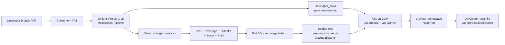
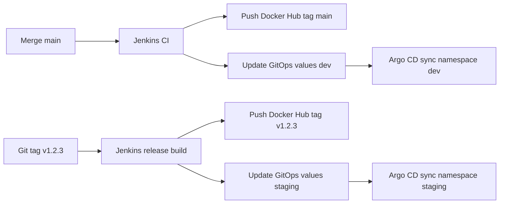

# Target Architecture Project 2 - Kế thừa Jenkins CI cũ

## Nguyên tắc bắt buộc

Project 2 là mở rộng CI Project 1 thành CI/CD. Phương án chính là tái sử dụng Jenkins cũ từ Project 1.

Không thiết kế lại từ đầu. Không thay Jenkins bằng GitHub Actions. Không mặc định cài Jenkins mới trên Google Cloud. Google Cloud chỉ dùng để dựng Kubernetes/K3s cluster và chạy workload YAS. Jenkins cũ điều phối CI/CD, build image, push Docker Hub và deploy vào K3s bằng kubeconfig/service account.

Jenkins mới chỉ là phương án dự phòng nếu Jenkins Project 1 không truy cập được, hỏng nặng, thiếu tài nguyên không thể xử lý, hoặc không thể kết nối Kubernetes cluster.

## Kiến trúc chính



## Thành phần hạ tầng

| Thành phần | Vai trò |
|---|---|
| Jenkins cũ Project 1 | Trung tâm CI/CD, branch scan, test/build/coverage/scan, Docker build/push, deploy K3s |
| Docker Hub | Registry image của nhóm |
| Google Cloud Compute Engine | Chạy `yas-master` và `yas-worker` |
| `yas-master` | K3s server/control-plane, Argo CD nếu làm nâng cao, Istio control plane nếu làm nâng cao |
| `yas-worker` | Chạy workload YAS và expose NodePort |
| K3s | Kubernetes cluster gọn nhẹ cho đồ án |
| Helm chart `k8s/charts/*` | Deploy service YAS, override image repository/tag |
| Argo CD | Nâng cao cho namespace `dev` và `staging` |
| Istio/Kiali | Nâng cao service mesh, mTLS, retry, AuthorizationPolicy, topology |

## CI flow

1. Developer push branch hoặc mở PR.
2. Jenkins Multibranch Pipeline scan branch.
3. Stage `Detect Changed Services` xác định service bị đổi.
4. Jenkins chạy tuần tự:
   - Gitleaks.
   - Build `common-library` nếu cần.
   - Maven test/verify cho service đổi.
   - Publish JUnit.
   - Publish JaCoCo coverage.
   - Enforce coverage 70%.
   - SonarCloud.
   - Snyk.
5. Nếu CI pass, Jenkins build Docker image cho service đổi.
6. Jenkins push image lên Docker Hub.

Lưu ý Jenkins 8GB RAM:

- Không build full 14 service song song.
- Nếu nhiều service đổi, build tuần tự.
- Nếu `pom.xml` hoặc `common-library` đổi, ưu tiên build tuần tự nhóm service demo trước nếu thời gian gấp.

## Docker build/push flow

Tag bắt buộc theo đề:

```bash
docker.io/<dockerhub-user>/yas-tax:<commit-sha>
```

Tag mặc định cho deployment:

```bash
docker.io/<dockerhub-user>/yas-tax:main
```

Tag alias tùy chọn để dễ nhìn:

```bash
docker.io/<dockerhub-user>/yas-tax:dev_tax_service
```

Quy tắc:

- Branch bất kỳ: luôn push tag commit SHA.
- Branch `main`: push thêm tag `main`.
- Branch developer: có thể push thêm tag branch alias, nhưng báo cáo phải nhấn mạnh commit SHA là tag chính.
- Docker Hub credential lưu trong Jenkins Credentials, ví dụ `dockerhub-credentials`.

Ví dụ command trong Jenkins:

```bash
COMMIT_SHA="$(git rev-parse --short=12 HEAD)"
IMAGE="docker.io/<dockerhub-user>/yas-tax"
docker build -t "$IMAGE:$COMMIT_SHA" -t "$IMAGE:${BRANCH_NAME//\//-}" ./tax
if [ "$BRANCH_NAME" = "main" ]; then
  docker tag "$IMAGE:$COMMIT_SHA" "$IMAGE:main"
fi
docker push "$IMAGE:$COMMIT_SHA"
docker push "$IMAGE:${BRANCH_NAME//\//-}"
if [ "$BRANCH_NAME" = "main" ]; then
  docker push "$IMAGE:main"
fi
```

## CD preview flow - `developer_build`

Jenkins job `developer_build` là Pipeline parameterized job trong Jenkins cũ.

Parameters:

- `ENV_NAME`, ví dụ `team1`, `tax-demo`, `demo-final`.
- `PRODUCT_BRANCH`, default `main`.
- `CART_BRANCH`, default `main`.
- `ORDER_BRANCH`, default `main`.
- `CUSTOMER_BRANCH`, default `main`.
- `INVENTORY_BRANCH`, default `main`.
- `TAX_BRANCH`, default `main`.
- `MEDIA_BRANCH`, default `main`.
- `SEARCH_BRANCH`, default `main`.
- `STOREFRONT_BFF_BRANCH`, default `main`.
- `STOREFRONT_UI_BRANCH`, default `main`.
- `BACKOFFICE_BFF_BRANCH`, default `main`.
- `BACKOFFICE_UI_BRANCH`, default `main`.
- `SWAGGER_UI_BRANCH`, default `main`.

Logic:

1. Jenkins checkout repo.
2. Với mỗi parameter:
   - Nếu là `main`: dùng image tag `main`.
   - Nếu khác `main`: `git fetch origin <branch>` và lấy `git rev-parse --short=12 origin/<branch>`.
3. Deploy vào namespace `preview-<ENV_NAME>`.
4. Các service không nhập branch riêng dùng `main`.
5. Expose preview bằng NodePort.

Ví dụ Helm:

```bash
helm dependency build k8s/charts/tax
helm upgrade --install tax k8s/charts/tax \
  -n preview-demo --create-namespace \
  --set backend.image.repository=docker.io/<dockerhub-user>/yas-tax \
  --set backend.image.tag=<commit-sha>
```

Vì repo hiện có chart riêng từng service, nên cách nhanh nhất là Jenkins loop qua danh sách service và chạy `helm upgrade --install` từng chart với `--set ...image.repository` và `--set ...image.tag`.

## Cleanup flow

Tạo Jenkins job `developer_cleanup`.

Parameters:

- `ENV_NAME`, ví dụ `demo`.
- `CONFIRM_DELETE`, giá trị phải là `DELETE`.

Command:

```bash
test "$CONFIRM_DELETE" = "DELETE"
kubectl delete namespace "preview-$ENV_NAME" --ignore-not-found=true
```

Nếu không muốn xóa namespace, có thể xóa Helm release:

```bash
for release in product cart order customer inventory tax media search storefront-bff storefront-ui backoffice-bff backoffice-ui swagger-ui; do
  helm uninstall "$release" -n "preview-$ENV_NAME" || true
done
```

## Namespace strategy

| Namespace | Mục đích | Chủ quản |
|---|---|---|
| `preview-<env-name>` | Preview developer theo job `developer_build` | Jenkins |
| `dev` | Auto deploy khi `main` thay đổi, nếu làm Argo CD | Argo CD |
| `staging` | Deploy release tag `vX.Y.Z`, nếu làm Argo CD | Argo CD |
| `argocd` | Argo CD control plane | Infrastructure/GitOps |
| `istio-system` | Istio/Kiali | Service Mesh |
| `keycloak`, `postgres`, `kafka`, `elasticsearch` | Dependency YAS | Infrastructure |

## NodePort/domain strategy

Không cần DNS thật. Preview dùng domain local do developer tự thêm vào hosts file.

Ví dụ:

```text
<WORKER_EXTERNAL_IP> yas-preview.local
```

Truy cập:

```text
http://yas-preview.local:30080
```

Chỉ preview dùng NodePort. Dev/staging nếu làm Argo CD có thể dùng ClusterIP hoặc port-forward để tránh đụng NodePort.

Firewall Google Cloud:

- Mở SSH cho IP nhóm.
- Mở K3s internal giữa master/worker.
- Mở NodePort demo, ví dụ `30080`, chỉ cho IP cần demo nếu có thể.
- Không mở toàn bộ `30000-32767` nếu không cần.

## Argo CD dev/staging flow nâng cao



Thứ tự ưu tiên:

1. Bắt buộc: Jenkins preview deploy trước.
2. Nâng cao: Argo CD cho `dev` khi main đổi.
3. Nâng cao hơn: release tag `vX.Y.Z` cho `staging`.

Không để Argo CD thay Jenkins CI. Jenkins vẫn build/test/scan/push image; Argo CD chỉ sync manifest/Helm values.

## Service mesh flow nâng cao

Mục tiêu demo:

- Enable Istio injection cho namespace demo.
- Bật mTLS strict.
- Tạo AuthorizationPolicy allow/deny rõ ràng.
- Tạo VirtualService retry cho một service, ví dụ `tax`.
- Dùng Kiali chụp topology.
- Dùng `curl` từ pod trong cluster để chứng minh allow/deny và retry.

Manifest cần có:

- `PeerAuthentication` mTLS strict.
- `AuthorizationPolicy` chỉ allow service hợp lệ.
- `VirtualService` retry khi upstream trả 500/5xx.
- `DestinationRule` nếu cần traffic policy.

## Secret management

Không commit secret thật vào repo.

Lưu ở Jenkins Credentials:

- Docker Hub username/password hoặc access token.
- Kubeconfig K3s hoặc Kubernetes service account token.
- SonarCloud token/config.
- Snyk token.

Lưu ở Kubernetes Secret:

- Database password.
- Keycloak credential.
- Image pull secret nếu Docker Hub private.

Repo chỉ được để placeholder:

```text
<dockerhub-user>
<WORKER_EXTERNAL_IP>
<JENKINS_CREDENTIAL_ID>
```

## Demo flow cho giảng viên

1. Mở Jenkins Project 1 cũ, cho thấy Multibranch Pipeline.
2. Push branch `dev_tax_service`, sửa nhỏ ở `tax`.
3. Jenkins chỉ detect/build/test/scan `tax`.
4. Jenkins push image `docker.io/<user>/yas-tax:<commit-sha>`.
5. Chạy job `developer_build`:
   - `TAX_BRANCH=dev_tax_service`.
   - Các service khác để `main`.
6. Kiểm tra pod trong namespace `preview-demo`.
7. Mở `http://yas-preview.local:30080`.
8. Chạy cleanup job, namespace preview bị xóa.
9. Nếu có nâng cao:
   - Merge main auto dev qua Argo CD.
   - Tag `v1.2.3` deploy staging.
   - Kiali topology, mTLS, retry, AuthorizationPolicy allow/deny.
